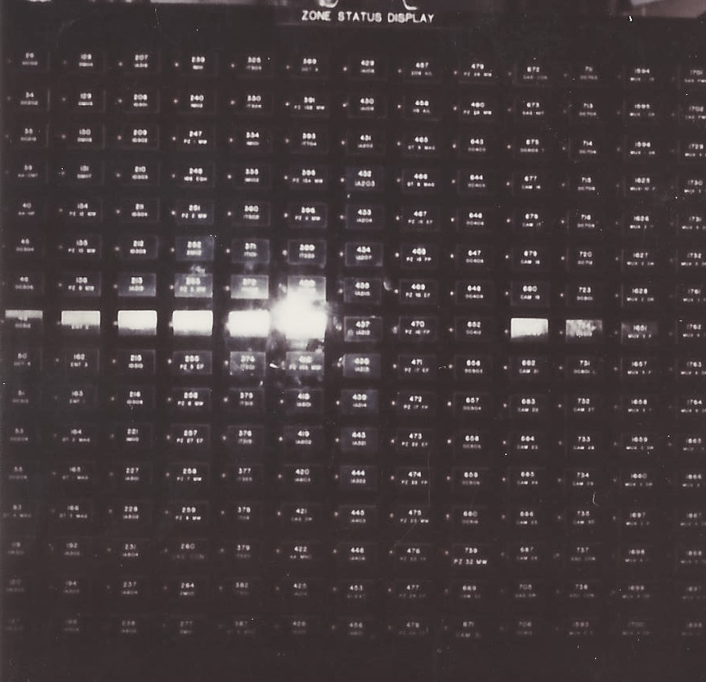

The Zone Status Display - Solved critical Grand Gulf Nuclear plant security problem by developing an electronic custom status display system.  Designed, and built a flat panel led display panel, electronic I/O boards, and programmed firmware for embedded Z80 micro-controller-based zone status display system. 

