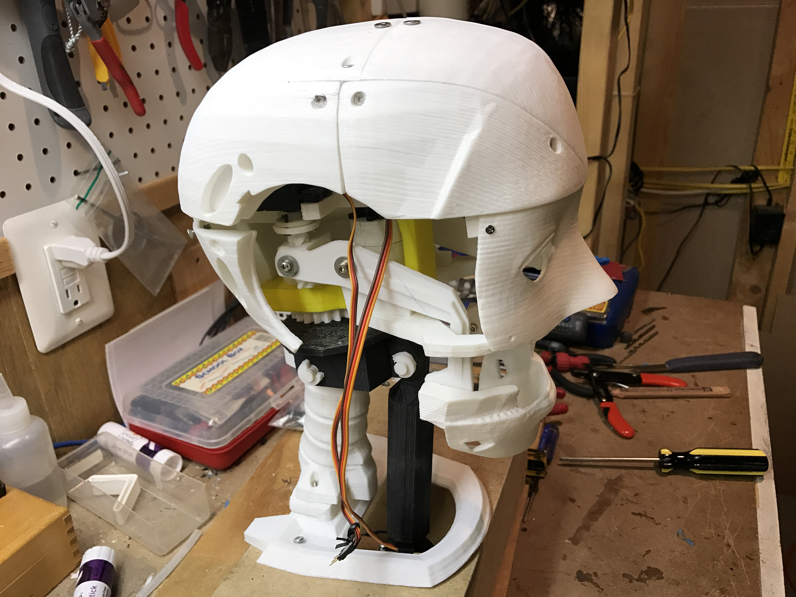

The InMoov robot is a life-sized marvel, not forged in metal, but born from plastic in your very own 3D printer. This open-source project, conceived by artist Gael Langevin, empowers anyone with the desire and tinkering spirit to bring a humanoid robot to life. Imagine limbs constructed layer by layer, powered by servos and controlled by Arduino microcontrollers. InMoov isn't just about the build; it's a platform for creativity. Breathe life into it with AI and machine learning, allowing it to converse, move with purpose, and even express emotions. This isn't science fiction; it's a tangible future where technology and imagination intersect, democratizing robotics and placing the power to create a thinking, moving machine in your hands. So, fire up your 3D printer, join the vibrant InMoov community, and be part of building the robots of tomorrow, today.

Imagine the InMoov, the open-source 3D printed humanoid robot, not only moves and responds to your commands but also engages in natural, nuanced conversation. Enter ChatGPT, a powerful language model, stepping onto the scene to fuel InMoov's social side. This integration unlocks a world of possibilities. InMoov could become a chatty companion, answering your questions, cracking jokes, and even learning your preferences over time. Imagine educational robots in classrooms, patiently explaining complex concepts in relatable language. Think robots offering emotional support, their words carefully chosen to soothe and uplift. The possibilities extend beyond personal interactions. InMoov, empowered by ChatGPT, could become a versatile customer service rep, understanding and responding to inquiries with human-like empathy. Even the healthcare field beckons, with robots offering AI-driven cognitive assessments or companionship to lonely patients. The integration of InMoov and ChatGPT is a glimpse into a future where robots seamlessly integrate into our lives, bridging the gap between machine and human through the power of conversation. While technical hurdles remain, this exciting fusion holds the potential to revolutionize the way we interact with technology and each other.

