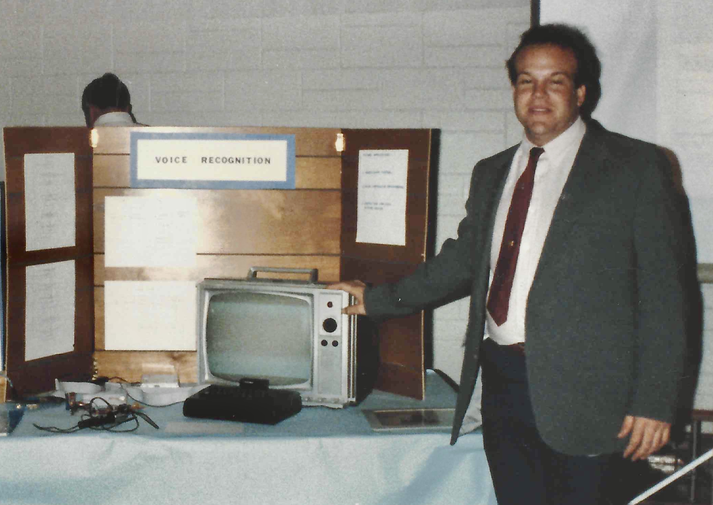

![LaTech 1st Place Project Voice Reconition System]

![My Timex Sinclar Voice Rec System]

While the Timex Sinclair computers had some peripherals and software related to sound and speech, they weren't capable of true voice recognition in the way modern computers do. Here's what they could offer:

1. Speech Synthesis:

The Speech Pack add-on allowed the computer to speak pre-recorded words and phrases using digitized audio clips stored in ROM. This wasn't true text-to-speech but rather playback of stored sounds.
2. Limited Voice Recognition:

The SRS2000 Speech Recognition System could recognize up to eight spoken words, trained by the user repeating them multiple times. It used simple pattern matching and didn't understand natural language.

The Big Ears Speech Recognition system offered similar functionality, recognizing eight spoken words after training. It also included a text-to-speech converter.

3. Sound Input and Processing:

The Timex Sinclair computers had basic microphone jacks that could be used for recording simple sounds, but not for complex voice analysis.
4. Speech-Related Software:

Some software programs existed for generating sound effects or using pre-recorded speech samples for simple interactions. However, these didn't involve real-time recognition of natural language.
Overall:

While the Timex Sinclair computers could generate and interact with sounds to some extent, they lacked the processing power and sophisticated algorithms needed for true voice recognition as we know it today. The available options were limited to pre-recorded sounds, basic pattern matching for a small number of trained words, and simple sound processing.

universityprojects/VoiceRecognition/latech-voicerecognition/scan0037.jpg

